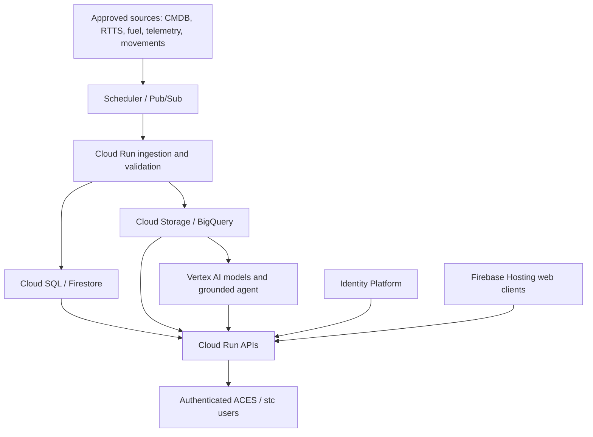

# ACES MSD stc COW Digitization — use case and Google Cloud deployment plan

Seven ACES digitization use cases for the stc Cell on Wheels (COW) project. The linked GitHub deployments are **pilots**. This document defines the proposed demonstration deployment in the **company-owned Google Cloud project requested from the account manager**, not a claim that the project, access, integrations, or stc production approval already exist.

## Portfolio and current starting point

| # | Use case | Pilot repository | Current focus | Google Cloud demonstration target |
| --- | --- | --- | --- | --- |
| 1 | Energy Consumption & CO₂ Emissions Tracking Dashboard and Fuel Management System | [Energy-Dashboard](https://github.com/Bannaga-Abdalmuhsin/Energy-Dashboard) | Data collection, national coverage, fuel and emissions validation | Firebase Hosting; Cloud Run ingestion/API; Cloud SQL; BigQuery reporting; Maps |
| 2 | Predictive Site Energy & Environmental Performance Digital Twin | [Cow-Risk-Dashboard_new](https://github.com/Bannaga-Abdalmuhsin/Cow-Risk-Dashboard_new) | Validate engineering inputs and S1–S4 scenarios against measured loads | Firebase Hosting; Cloud Run simulation; BigQuery history; Vertex AI after baseline validation |
| 3 | Passive Infrastructure Equipment Asset Management | [asset-managment](https://github.com/Bannaga-Abdalmuhsin/asset-managment) | CMDB coverage, status, CAPEX/OPEX and risk flags | Firebase Hosting; Cloud Run API; Cloud SQL; Cloud Storage; Maps |
| 4 | Complaint Feedback Integration via Site-Level QR Codes | Repository link pending | Submission flow, domain and site identity verification | Firebase Hosting QR form; Cloud Run API; Firestore workflow; Cloud Storage attachments |
| 5 | Fault Management Workforce Tracker App | [fault-managment](https://github.com/Bannaga-Abdalmuhsin/fault-managment) | RTTS/Remedy integration, dispatch, escalation, evidence and access control | Firebase Hosting portal; Cloud Run API; Firestore live work state; Cloud SQL ticket history; Pub/Sub |
| 6 | AI Operations Chatbots | [AI-Ops](https://github.com/Bannaga-Abdalmuhsin/AI-Ops) | Grounded answers, escalation and channel approvals | Cloud Run agent/API; Vertex AI; BigQuery/approved knowledge source; Secret Manager |
| 7 | Movement Prediction and Analysis Tool | [AI-COW-Deployment](https://github.com/Bannaga-Abdalmuhsin/AI-COW-Deployment) and [cow-ai-delopyment](https://github.com/Bannaga-Abdalmuhsin/cow-ai-delopyment) | Historical movement validation, date window and agent responses | Firebase Hosting; Cloud Run inference/API; BigQuery training data; Vertex AI; Maps |

Repository availability, branches and implementations must be verified with each use-case owner before migration. The QR repository is not yet identified. The table is a target architecture, not an assertion that these services are already enabled.

## Company account request and prerequisites

Request a company-owned project with display name **ACES MSD stc COW Digitization**. Google Cloud project ID must be chosen separately because display names and project IDs have different rules. The account administrator should attach the approved billing account, select the approved region and data residency, enable the required APIs, establish budgets and alerts, and grant the named developer least-privilege access through company identity. Do not use a personal billing account or share owner credentials.

| Requested capability | Product | Planned use |
| --- | --- | --- |
| Hosting and APIs | Firebase Hosting, Cloud Run | Static web clients; authenticated APIs, ingestion, simulation and inference services |
| Data stores | Cloud SQL **or** Firestore, Cloud Storage, BigQuery | Cloud SQL for relational CMDB/tickets/transactions; Firestore for live workflow where suitable; Storage for evidence and approved files; BigQuery for analytics and model data |
| Maps and location | Google Maps Platform | Authorized COW maps, routes and geospatial presentation; restrict browser keys by referrer and API |
| AI and prediction | Vertex AI | Evaluated forecasts and grounded assistant services after source and access approval |
| Scheduled updates | Cloud Scheduler, Pub/Sub | Scheduled source pulls and event-driven processing with retries and idempotency |
| Deployment and security | Cloud Build, Artifact Registry, Secret Manager, Identity Platform, Cloud Monitoring | Build images, deploy releases, hold secrets, authenticate users, observe service health |

Administrator prerequisites: confirm stc/ACES data ownership, permitted data classification and residence, approved identity federation/SSO, access to source systems (CMDB, telemetry, RTTS/Remedy, fuel, complaints and movement records), connector ownership, service account permissions, demonstration audience and cost ceiling. An API cannot be integrated solely by enabling a Google Cloud service; source-system credentials and stc approval are separate gates.

## Shared target architecture

Use one canonical COW ID and region mapping across use cases. Define source timestamp, ingestion timestamp, provenance, freshness and ownership per dataset. Validate IDs, coordinates, status and units at ingestion; quarantine invalid records; reconcile source and destination row counts. Publish an explicit data contract for cross-app reads so that energy, assets, risk and movement do not create conflicting site records. Scope each API and query by authorized role and region on the server.

Cloud SQL and Firestore are **workload choices**, not a requirement to copy every record into both. Keep source of truth and retention documented. Use Cloud Storage for uploads with private buckets and time-limited access. Keep analytical copies in BigQuery with access controls and retention. Do not expose unrestricted Maps keys, service account keys, database passwords or operational records in browser bundles or public repositories.

## Deployment plan by use case

### 1. Energy, CO₂ and fuel

1. Inventory the current dashboard data model, formulas, regional coverage and Supabase/Google Sheet imports. Freeze an approved schema for site, timestamped meter/estimated energy, generator runtime, fuel delivery, tank level, emissions factor and data-quality flag.
2. Move the Vite web build to Firebase Hosting. Move privileged imports and calculations to Cloud Run; store operational transactions in Cloud SQL and validated time series/aggregates in BigQuery. Use Cloud Scheduler → Pub/Sub → Cloud Run for approved periodic refreshes.
3. Reconcile energy, diesel and CO₂ totals against the existing dashboard for representative sites and reporting periods. Label estimated values, source dates and gaps. Set alerts for delayed feeds and low fuel without claiming real-time data where the source is batch based.
4. Restrict map access and reports by approved roles. Demonstrate fuel plan, site status, emissions methodology and export against approved sample or authorized live data.

### 2. Predictive energy and environmental digital twin

1. Preserve the existing deterministic engineering model and S1–S4 stress scenarios as an auditable baseline. Record nameplate assumptions, vendor telecom loads, ambient/weather inputs, battery, cooling and generator limits.
2. Serve simulation from Cloud Run, historical telemetry and environmental observations from BigQuery, and the client from Firebase Hosting. Add Vertex AI only after measured baseline, data completeness, holdout design and acceptance metrics are agreed.
3. Compare predictions with measured energy/fuel, quantify error by site and season, version models and inputs, and expose confidence/limitations. Treat forecasts as engineering decision support; operational switching remains subject to an approved control process.
4. Demonstrate a site what-if case with source values, S1–S4 flags, forecast versus actual and model version.

### 3. Passive infrastructure assets

1. Define the authoritative CMDB, asset catalogue, status, CAPEX/OPEX and warehouse data owners. Import only catalogue COW IDs; preserve source timestamps and deduplicate latest CAPEX entry per site/category as required by the UI.
2. Move the static client to Firebase Hosting and privileged reads/writes to a Cloud Run API. Use Cloud SQL for relational assets/work orders, Cloud Storage for authorized photos/documents and Google Maps Platform for map presentation. Migrate Supabase data after field mapping and reconciliation, without exposing service-role credentials.
3. Enforce server-side role and region authorization; attach S1–S4 risk flags only to matched sites. Verify ON-AIR/OFF-AIR counts, coordinate quality, search, warehouse distance and exports.
4. Demonstrate a single COW record from national map through asset details, related CAPEX/OPEX and risk flags, with audit trail and freshness shown.

### 4. QR complaint feedback

1. Assign a repository and product owner. Define a signed/registered QR code mapping to a COW ID; prevent forged site IDs and avoid placing personal or operational data in the QR URL.
2. Host an accessible mobile form on Firebase Hosting. Submit to Cloud Run with abuse protection, input validation and attachment scanning/limits; store workflow state in Firestore and private attachments in Cloud Storage.
3. Define acknowledgement, triage, assignment, escalation, closure and retention, with role permissions and appropriate consent/privacy wording. Route events through Pub/Sub only after approved downstream integration.
4. Demonstrate scan → submit → track → close with a test site, including duplicate handling and response time measurement.

### 5. Fault management workforce tracker

1. Obtain approved RTTS/Remedy interface documentation, sandbox credentials and event semantics. Map ticket ID, state, priority, site, clearance group, region, technician and timestamps; establish replay and deduplication rules.
2. Ingest events through Cloud Run and Pub/Sub. Keep ticket history and assignment audit in Cloud SQL; use Firestore for rapidly changing task/technician state if latency warrants it. Host the web portal on Firebase Hosting; have the mobile app call the same protected API.
3. Implement rule-based assignment with technician availability, region and escalation matrix; require human override and logged reassignment. Handle offline work, restoration evidence in private Cloud Storage, and delayed/out-of-order RTTS events.
4. Verify no-data dashboard, dispatch latency, ticket reconciliation, MTTR and role/region boundaries in a sandbox before any live auto-dispatch. Obtain stc cybersecurity and integration sign-off.

### 6. AI Operations chatbots

1. Define approved knowledge sources, allowed questions, channel ownership and escalation rules. Keep Telegram/WhatsApp or other channel tokens in Secret Manager; obtain channel and stc approvals before connecting them to operational data.
2. Run channel webhook and agent orchestration on Cloud Run. Use Vertex AI for responses with retrieval limited to authorized, current knowledge; place approved analytical content in BigQuery or another governed source and maintain document provenance.
3. Enforce per-user authorization, cite source and freshness in answers, refuse unsupported actions, record feedback and send uncertain/high-impact cases to a human. Redact sensitive fields from prompts/logs according to company policy.
4. Evaluate answer accuracy, leakage, latency, escalation and cost on a fixed test set before demonstration to stc.

### 7. Movement prediction and analysis

1. Establish the approved historical movement workbook as a private source with event date, COW ID, region, event/location and data corrections. Remove operational source records and embedded demo credentials from public web assets before using sensitive data.
2. Store validated history in BigQuery; train and version a time-aware model in Vertex AI after baselines and leakage checks. Serve prediction/search through Cloud Run and the client through Firebase Hosting, with Maps only where approved.
3. Present the next movement as an **estimated date window (±20 days)**, COW ID, region and event/location, plus confidence and last training date. Do not present a window as an actual confirmed deployment.
4. Ground the AI Operations Agent in authorized records through the protected API. Compare forecasts with future movements by region and event, and retrain on an agreed cadence after performance review.

## Security, delivery and operations gates

| Gate | Required evidence before moving forward |
| --- | --- |
| 0 — Access and scope | Project/billing/region approved; required APIs enabled; roles and service accounts granted; cost budget; named data owners and permitted demo data |
| 1 — Foundation | Identity Platform integration and role mapping; least-privilege IAM; Secret Manager; private data stores; Maps key restrictions; logging, Monitoring alerts, backups and retention |
| 2 — CI/CD | GitHub source connected to Cloud Build under company control; build/test checks; images in Artifact Registry; separate development and demonstration configurations; reviewed release and rollback procedure |
| 3 — Data migration | Schema mapping, source approval, validation, reconciliation, freshness/error monitoring and recovery/replay tests; no embedded real data in public bundles |
| 4 — Functional pilot | End-to-end use-case acceptance, empty/error states, mobile responsiveness, role isolation, auditability, cost and performance checks |
| 5 — stc demonstration | Demo dataset and attendees approved; runbook and support owner assigned; stc cybersecurity/integration review tracked separately before production or live sensitive feeds |

Prefer short-lived workload identity for CI/CD where supported; avoid long-lived JSON service-account keys. Restrict Cloud Run ingress/authentication and use private connectivity for Cloud SQL where applicable. Define least-privilege service accounts per service, separate user roles, audit logs, incident contacts and backup/restore tests. Cloud Monitoring should alert on ingestion failures, stale data, API errors, authentication anomalies and resource spending. A browser login alone is not a security boundary for protected data.

## Execution sequence and deliverables

| Phase | Work | Deliverable / exit criterion |
| --- | --- | --- |
| A — Discovery | Confirm repositories, owners, data contracts, source access, stc requirements and baseline metrics | Signed scope and integration register |
| B — Cloud foundation | Provision company project, billing, IAM, identities, secrets, observability and CI/CD | Approved environment and deployable empty shell |
| C — Shared data | Canonical COW catalogue, ingestion pipelines, stores, reconciliation and APIs | Authorized site search with freshness and audit |
| D — Portfolio migration | Migrate 1 and 3 first as shared energy/asset data foundations; then 2 and 7 analytics; then 4, 5 and 6 according to external interface approval | Seven usable demonstration flows, each with acceptance evidence |
| E — Review | Security, performance, cost, operational handover and stc demonstration | Go/no-go record; unresolved dependencies and owners |

Dependencies requiring decisions: QR repository; authoritative data owners; RTTS/Remedy access; WhatsApp/Telegram channel approval; permitted Maps APIs and domains; model validation thresholds; stc identity and cybersecurity controls. Track these as open items rather than describing them as completed.

## Repository hygiene

Keep code and sample fixtures in GitHub; keep secrets and controlled operational data out of Git history and public build artifacts. Remove hard-coded demonstration credentials before restricted deployment. Each implementation repository should document its build command, API contract, environment variables by **name only**, migrations, data classification, tests, rollback and runbook. Existing GitHub Pages/Supabase pilots can remain references during migration but should not be represented as company Google Cloud production environments.
